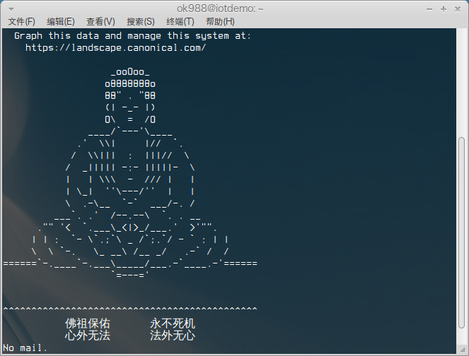
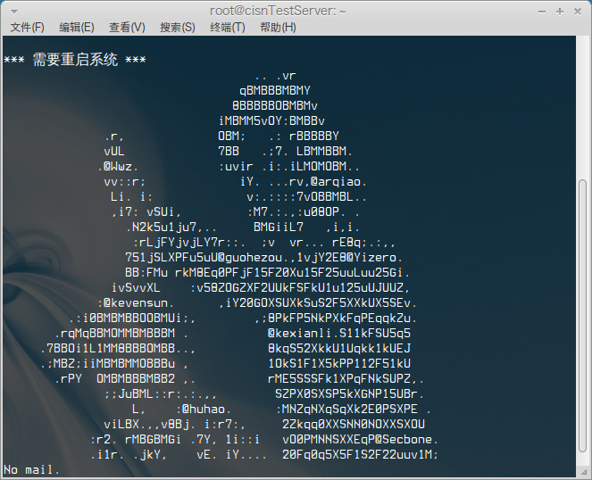

motd
====

My funny motd config. Just for fun!

ScreenShots & Usage
===
 **Buddha**

Usage:

* **For Ubuntu**:
  * **12.04**: Just copy the content from Buddha to ``/etc/motd.tail``(Maybe it's not exist, create it!)
  * **14.04**: Copy to ``/etc/motd``
* **For CentOS**:Just copy the content from Buddha to ``/etc/motd``




 **mom-beat-me-once**

(from [*here*](https://www.dnspod.cn/),look at its source code!)

Usage:

*As above*



 **HatsuneMiku**
(from [*here*](http://www.oschina.net/code/snippet_119695_38236))

```
               #########                       
              ############                     
              #############                    
             ##  ###########                   
            ###  ###### #####                  
            ### #######   ####                 
           ###  ########## ####                
          ####  ########### ####               
        #####   ###########  #####             
       ######   ### ########   #####           
       #####   ###   ########   ######         
      ######   ###  ###########   ######       
     ######   #### ##############  ######      
    #######  ##################### #######     
    #######  ##############################    
   #######  ###### ################# #######   
   #######  ###### ###### #########   ######   
   #######    ##  ######   ######     ######   
   #######        ######    #####     #####    
    ######        #####     #####     ####     
     #####        ####      #####     ###      
      #####      ;###        ###      #        
        ##       ####        ####              
```

**sexy**
(from ``freebuf.com``'s source code)

```
                              _.._        ,------------.
                           ,'      `.    ( We want you! )
                          /  __) __` \    `-,----------'
                         (  (`-`(-')  ) _.-'
                         /)  \  = /  (
                        /'    |--' .  \
                       (  ,---|  `-.)__`
                        )(  `-.,--'   _`-.
                       '/,'          (  Uu",
                        (_       ,    `/,-' )
                        `.__,  : `-'/  /`--'
                          |     `--'  |
                          `   `-._   /
                           \        (
                           /\ .      \.  freebuf
                          / |` \     ,-\
                         /  \| .)   /   \
                        ( ,'|\    ,'     :
                        | \,`.`--"/      }
                        `,'    \  |,'    /
                       / "-._   `-/      |
                       "-.   "-.,'|     ;
                      /        _/["---'""]
                     :        /  |"-     '
                     '           |      /
                                 `      |
```

**girl**
(Thank [@liaoishere](https://github.com/liaoishere) for pull request [#1](https://github.com/abcfy2/motd/pull/1))
```
                                                     /*[*/#include<stdio.h>//
                         #include<stdlib.h>//]++++[->++[->+>++++<<]<][(c)2013]
                        #ifndef                                           e//[o
                       #include<string.h>//]![misaka.c,size=3808,crc=d0ec3b36][
                      #define e                                           0x1//
                     typedef struct{int d,b,o,P;char*q,*p;}f;int p,q,d,b,_=0//|
                  #include __FILE__//]>>>[->+>++<<]<[-<<+>>>++<]>>+MISAKA*IMOUTO
                #undef e//[->[-<<+<+<+>>>>]<<<<<++[->>+>>>+<<<<<]>+>+++>+++[>]]b
             #define e(c)/**/if((_!=__LINE__?(_=__LINE__):0)){c;}//[20002,+[-.+]
            ,O,i=0,Q=sizeof(f);static f*P;static FILE*t;static const char*o[]={//
          "\n\40\"8oCan\40not\40open %s\n\0aaFbfeccdeaEbgecbbcda6bcedd#e(bbed$bbd",
        "a6bgcdbbccd#ead$c%bcdea7bccde*b$eebbdda9bsdbeccdbbecdcbbcceed#eaa&bae$cbe",
       "e&cbdd$eldbdeedbbdede)bdcdea&bbde1bedbbcc&b#ccdee&bdcdea'bbcd)e'bad(bae&bccd",
      "e&bbda1bdcdee$bbce#b$c&bdedcd%ecdca4bhcdeebbcd#e$b#ecdcc$bccda7bbcc#e#d%c*bbda",
     ">bad/bbda"};static int S(){return(o[p][q]);}static/**/int/**/Z=0  ;void/**/z(int//
    l){if(/**/Z-l){Z=l;q++;if(p<b*5&&!S()){p+=b;q=0;}}}int main(int I,    /**/char**l){//
   d=sizeof(f*);if(1<(O=_)){b=((sizeof(o)/sizeof(char*))-1)/4;q=22; p=     0;while(p<b*5){
  /*<*/if(Z-1){d=S()>96;i=S()-(d?96:32) ;q++;if(p<b*5&&!S()){p+=b;  q=      0;}Z=1;}/*[[*/
  while(i){_=o[0][S()-97];I=_-10?b:1;   for( ;I--;)putchar(_ );if   (!      --i||d)z(~i );}
 if(p==b*5&&O){p-=b;O--;}}return 0U;   }if(! (P=( f*)calloc /*]*/  (Q        ,I)))return 1;
 {;}for(_=p=1;p<I;p++){e(q=1);while    (q<   p&&  strcmp(  l[p     ]         ,l[(q)]))++  q;
 t=stdin;if(q<p){(void)memcpy/* "      */    (&P  [p],&P   [q     ]          ,Q);continue ;}
if(strcmp(l[p],"-")){t=fopen(l         [     p]   ,"rb"   )                  ;if(!t ){{;}  ;
printf(05+*o,l[p ]);return+1;                      {;}                       }}_=b= 1<<16   ;
*&O=5;do{if(!(P[p].q=realloc   (P[p].q,(P[p].P     +=       b)+1))){return   01;}O   &=72   /
6/*][*/;P[p].o+=d=fread(P[p]      .q       +P[     p           ].       o,  1,b,t)   ;}//
 while(d==b)      ;P [p].q[       P[       p]                  .o       ]=  012;d    =0;
 e(fclose(t        )  );P         [p]      .p                  =P[      p]  .q;if    (O)
 {for(;d<P[            p]          .o     ;d=                   q+     1)    {q=     d;
  while(q<P[                        p].o&&P[                    p].q[q]-     10     ){
  q++;}b=q-d;                         _=P                         [p].        d     ;
  if(b>_){/*]b                                                                */
   P[p].d=b;}{;                                                                }
   #undef/*pqdz'.*/  e//                                                      ;
   #define/*s8qdb]*/e/**/0                                                   //
   //<<.<<.----.>.<<.>++.++<                                              .[>]
   /*P[*/P[p].b++;continue;}}}t=                                       stdout;
  for (p=1;p<I;p++){/**/if(P[p].b>i                               ){i=P[p].b;}}
 if  (O){for(p=0;p<i;p++){q=0;/*[*/while(I               >++q){_=P[q].p-P[q ].q;
b=   0;if(_<P[q ].o){while(012-*P[q].p)     {putchar(*(P[q].p++));b++;}P[q]. p++;
}   ;while (P[  q].d>b++)putchar(040);}             putchar(10);}return 0;}p   =1;
   for(;   p<I   ;p++)fwrite(P[p] .q,P[              p].o,1,t);return 0 ;}//
  #/*]     ]<.    [-]<[-]<[- ]<[    -]<               [-  ]<;*/elif  e    //b
 |(1        <<     ( __LINE__        /*               >>   `*//45))  |     01U
             #                       /*               */     endif            //
 ```

 **dog**
(Thank [@liaoishere](https://github.com/liaoishere) for pull request [#1](https://github.com/abcfy2/motd/pull/1))
```
                                                                    Z=      "Vn"
  "-S"                                                             "xR9Q"   "[$s"
"Zd&o+"                                                            "pf^cM"  "cbac\
J_VHMF_"                                                           "BkaEg^" "x`i_i\
us%d]oWG:"                                                          "r`IZ.6_]H3ec]_\
bWW_^Ej2i[r"                                                         "ZZnJjW[bK`hZakb\
_l]gL3X]d_#$eK"                             "[G3 d[Xe][:V`4Z]Z"      "VfX^]V:X%b]N,ma-j"
"^m57c!`O.qP8lTc^"                    "gm,Um;m`m^^`5n_nci<Wf[h<t+e$%" "]Lha&=l Umc>m#_mdp"
   "h/codZ#i`,''mbb(fh"          ")h)(^uV9b7dcZq`^d`/*3`#ko`lj;^idad/]0ffxP*]??bff$h`@(Zgtcn"
       "k10t<A6mYZNh!g&a2^j" "!^hOZb!&]bd(]TuqI]#iepZc/XdX(Z X4a!dgpc>0q;]^7p`q*AtqC1j,'#_on tp"
             "on e !1+tA6`db`qciq`'=?ui]'`_`dk`!kx_%]bu]cZX8u_)Z=8@ghg$mlp`a>D_o2_eb)sb)sa0g@f-h"
                  "1bl_DeblFsa&Dt^t4*X *mCC^5Y",M _ A _ G _ I _ C _ K[]="',b}q}a9\"],)'(cDDJr4"
               "Ab,:sdtd/E*#2eXkZ7cPthkq`(stnhct!a:>A;A+jA9>A;A+js",*E=I;FILE*f;main
           (int d,Y()**t){$;!t;s=c=-D){$,t=v=D?k:J;v++-d;){$,o=L=z=0,s=D?J:k;s+++d
        -B-F;)(o&&(e=m),y=*Q!=(m=Q[u*i+(D?v-u*s:s-u*v)]))^o&&(G[z++]=s-L>20,L=s,o=y);$,
      s=z,o=0;s--;o+=G[s]^s[A]);$;z^w||o;z=w){$,o=1;o&&!--o*D-~-~-w|1[A]|v-a>28&&w^4|1[A]|
    3[A]|!2[A      ]|v-a>5;)$;I[g[I]=2,++g]=-1,-s<w;I[~-g]=A[-s--]);$,a=v,w=z;z--;A[z]=z[G]);
  }}$,v=a        =o;(Z=C+!D*734)[z=a]                         ^3;d=0){$;!~I[v];a=z,v=o=0)$,M[L
 ++]+=          Z[z]^4?-42:o;                                      Z[z++]^4;);      $;~z&&2>(s=I
 [v           ])&4<Z[z]                                                |Z[z]==s         ;)++z,s^2?
             d++,++                                                       v:v&&(o           +=d,a=z,
            z=-1                             );$;v++[                       I]^2;)             ;}}$;d
            ;d                             =c){$,p=*Z;F++                     [I]=                *++
                                        Z%p,*Z;);$,Z=C;x=F                     ,F=
                                        r,s=2,p---7;Q=E,E=Z
                                       ,Z=Q)$;s%x;p^(c=s++[E
                       ])?q*0+c:(q++,  q--));$;K[F];K[F++]-=p
                    );c=fseek((f=fopen(*++t,"rb"))?f:(exit(1)
                   ,f),10,r);j;n=j=j=j;i=j;F=a=fseek(f,n,c);
                  Q=calloc(z=i--*u,4);$;a^z;fread(a+++Q,L>>
                  19,1,f));$;F++<i;r=n){$,n=0,B=u;B;n|=*Q^Q
                  [u*(i-F)+--B]);$,n&&Y(!r&&(D=F-J,J=F);
                 !n&&r;r=x=!put)(10))$;B^u;B++,c=p){$,p=
                0,s=J;s^F;p|=*Q^Q[B+u*(i-s++)]);$;p&&!c;
              )$;++Y        (c*F-J<<1<5*((k=B)-x);put)(32
             ),++c);          $;!p&&c;x=B){$,F-J<<1<Y(D&&
              put)(           10),D=95;D--;D[M]=0);$;main(
               ++D?B:           F,w=a=g=0),!D;);$;x=K[o++]-
                 27;M             [x]*M[K[o++]    -27]>0&&(M
                                    [x]=s));$;     ++c^L;M[c]
                                      >s&&(s=M[       x=c]));$;
                                       3^d||printf      (K+--o,(
                                          *Q P,(e P),      D*!(c+~x);
                                               w++)$,o=     '~';-~o;)$
                                                 [w]Y(^--     o||put)(D=
                                                   o);0;);c     =Y(~o&&!
                                                    put)(*K+     x);}}}}}
```

**doge**
(Thank [@jackeyGao](https://github.com/jackeyGao) for pull request [#2](https://github.com/abcfy2/motd/pull/2))
